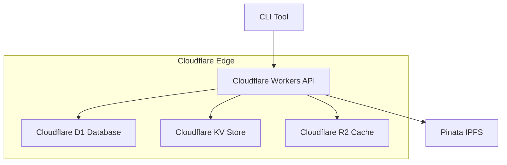

# Etherith CLI - Deployment Guide

This guide covers deployment strategies for the Etherith CLI Memory Archival Platform, with a focus on Cloudflare deployment as recommended by our infrastructure consultants.

## 🎯 Deployment Overview

### Current Architecture (v0.1)
- **CLI Tool**: Local Node.js application
- **Database**: Local SQLite for indexing
- **Storage**: IPFS via Pinata API
- **Scope**: Single-user, local operation

### Target Architecture (v0.2)
- **CLI Tool**: Communicates with cloud API
- **API Server**: Cloudflare Workers (Express.js)
- **Database**: Cloudflare D1 (SQLite compatible)
- **Storage**: IPFS (Pinata) + Cloudflare R2 cache
- **Session Management**: Cloudflare KV
- **Scope**: Multi-user, globally distributed

## 🚀 Cloudflare Deployment Strategy

### Service Architecture



### 1. Cloudflare Workers Setup

**Install Wrangler CLI:**
```bash
npm install -g wrangler
wrangler login
```

**Create `wrangler.toml`:**
```toml
name = "etherith-api"
main = "dist/worker.js"
compatibility_date = "2024-03-15"

[vars]
ENVIRONMENT = "production"

[[d1_databases]]
binding = "DB"
database_name = "etherith-db"
database_id = "your-database-id"

[[kv_namespaces]]
binding = "SESSIONS"
id = "your-kv-namespace-id"

[[r2_buckets]]
binding = "CACHE"
bucket_name = "etherith-cache"
```

### 2. Database Migration (SQLite → D1)

**Create D1 Database:**
```bash
wrangler d1 create etherith-db
```

**Export Current Schema:**
```bash
sqlite3 .etherith/index.db .dump > schema.sql
```

**Migrate to D1:**
```bash
wrangler d1 execute etherith-db --file=schema.sql
```

**Update Database Queries:**
- Replace `sqlite3` with D1 bindings
- Use Workers D1 API for database operations
- Implement connection pooling for performance

### 3. API Server Implementation

**Create `src/worker.ts`:**
```typescript
import { Hono } from 'hono';
import { cors } from 'hono/cors';

const app = new Hono();

app.use('/api/*', cors());

app.post('/api/files', async (c) => {
  // File upload endpoint
});

app.get('/api/files/search', async (c) => {
  // Search endpoint
});

export default app;
```

### 4. Secrets Management

**Set production secrets:**
```bash
wrangler secret put PINATA_API_KEY
wrangler secret put PINATA_SECRET_KEY
wrangler secret put OPENAI_API_KEY
```

**Access in Workers:**
```typescript
const pinataKey = env.PINATA_API_KEY;
const pinataSecret = env.PINATA_SECRET_KEY;
```

### 5. CLI Update for API Communication

**Update CLI to use Workers API:**
```typescript
// src/lib/api-client.ts
export class ApiClient {
  private baseUrl: string;

  constructor(baseUrl: string = 'https://etherith-api.your-subdomain.workers.dev') {
    this.baseUrl = baseUrl;
  }

  async uploadFile(file: Buffer, metadata: FileMetadata) {
    const response = await fetch(`${this.baseUrl}/api/files`, {
      method: 'POST',
      body: formData,
      headers: { 'Authorization': `Bearer ${this.getToken()}` }
    });
    return response.json();
  }
}
```

### 6. Performance Optimization

**Smart Placement:**
```toml
[placement]
mode = "smart"
```

**Caching Strategy:**
```typescript
// Cache frequent queries in R2
const cacheKey = `search:${query}`;
const cached = await env.CACHE.get(cacheKey);
if (cached) return JSON.parse(cached);

// ... perform search ...
await env.CACHE.put(cacheKey, JSON.stringify(results), { expirationTtl: 3600 });
```

## 💰 Cost Analysis

### Cloudflare Pricing (Estimated Monthly)

| Service | Free Tier | Expected Usage | Estimated Cost |
|---------|-----------|----------------|----------------|
| **Workers** | 100K requests/day | ~50K/month | $0 |
| **D1** | 100K reads, 1K writes/day | Within limits | $0 |
| **KV** | 100K reads, 1K writes/day | Within limits | $0 |
| **R2** | 10GB storage, Class A/B ops | 1GB usage | $0.01 |
| **Total** | | | **$0-5/month** |

### Scaling Costs

| Users | Requests/Month | D1 Operations | Estimated Cost |
|-------|----------------|---------------|----------------|
| 1-10 | <100K | <100K reads | $0-1 |
| 10-100 | 100K-1M | 100K-1M reads | $1-5 |
| 100-1K | 1M-10M | 1M-10M reads | $5-25 |

## 🔧 Development Deployment

### Local Development with Workers

**Start local development:**
```bash
wrangler dev --local
```

**Test with local D1:**
```bash
wrangler d1 execute etherith-db --local --file=test-data.sql
```

### Staging Environment

**Deploy to staging:**
```bash
wrangler deploy --env staging
```

**Staging configuration:**
```toml
[env.staging]
name = "etherith-api-staging"
vars = { ENVIRONMENT = "staging" }
```

## 🚀 Production Deployment

### Deployment Checklist

- [ ] **Secrets configured** (Pinata, OpenAI keys)
- [ ] **D1 database** created and migrated
- [ ] **KV namespace** created for sessions
- [ ] **R2 bucket** created for caching
- [ ] **Custom domain** configured (optional)
- [ ] **Analytics** enabled
- [ ] **Monitoring** alerts configured

### Deploy Commands

```bash
# Build production assets
npm run build

# Deploy to production
wrangler deploy

# Verify deployment
curl https://etherith-api.your-subdomain.workers.dev/health
```

### Post-Deployment

**Monitor performance:**
```bash
wrangler tail
```

**Check analytics:**
- Visit Cloudflare Dashboard
- Monitor request volume and errors
- Set up alerting for failures

## 🔐 Security Configuration

### Access Control

**Configure CORS:**
```typescript
app.use('/api/*', cors({
  origin: ['https://your-domain.com'],
  allowMethods: ['GET', 'POST', 'PUT', 'DELETE'],
  allowHeaders: ['Content-Type', 'Authorization'],
}));
```

**Rate Limiting:**
```typescript
import { RateLimiter } from '@cloudflare/workers-rate-limiter';

const rateLimiter = new RateLimiter({
  keyGenerator: (request) => request.headers.get('CF-Connecting-IP'),
  windowMs: 15 * 60 * 1000, // 15 minutes
  max: 100 // requests per window
});
```

### API Authentication

**JWT Token Implementation:**
```typescript
import { sign, verify } from '@tsndr/cloudflare-worker-jwt';

// Generate token
const token = await sign({ userId: user.id }, env.JWT_SECRET);

// Verify token
const isValid = await verify(token, env.JWT_SECRET);
```

## 📊 Monitoring & Analytics

### Cloudflare Analytics

- **Request Volume**: Track API usage patterns
- **Error Rates**: Monitor 4xx/5xx responses
- **Performance**: P95/P99 response times
- **Geographic Distribution**: User locations

### Custom Metrics

**Add telemetry:**
```typescript
// Log custom events
console.log(JSON.stringify({
  timestamp: new Date().toISOString(),
  event: 'file_uploaded',
  userId: user.id,
  fileSize: file.size,
  ipfsHash: hash
}));
```

### Alerting

**Set up alerts for:**
- Error rate > 5%
- Response time > 1000ms
- Database connection failures
- Pinata API failures

## 🔄 Rollback Strategy

### Version Management

**Tag releases:**
```bash
git tag -a v0.2.0 -m "Cloudflare deployment"
wrangler deploy --compatibility-date 2024-03-15
```

**Rollback procedure:**
```bash
# Revert to previous version
git checkout v0.1.0
wrangler deploy
```

### Database Rollback

**Backup before migration:**
```bash
wrangler d1 backup create etherith-db
```

**Restore if needed:**
```bash
wrangler d1 backup restore etherith-db <backup-id>
```

## 🧪 Testing in Production

### Health Checks

**API Health endpoint:**
```typescript
app.get('/health', async (c) => {
  return c.json({
    status: 'healthy',
    timestamp: new Date().toISOString(),
    version: '0.2.0',
    database: await testDbConnection(),
    pinata: await testPinataConnection()
  });
});
```

### Integration Tests

**Test deployment:**
```bash
# Test file upload
curl -X POST https://etherith-api.workers.dev/api/files \
  -F "file=@test.jpg" \
  -H "Authorization: Bearer $TOKEN"

# Test search
curl "https://etherith-api.workers.dev/api/files/search?q=test" \
  -H "Authorization: Bearer $TOKEN"
```

## 📈 Scaling Considerations

### Performance Optimization

- **Database Indexing**: Optimize D1 queries
- **Caching Strategy**: Implement intelligent R2 caching
- **CDN Usage**: Leverage Cloudflare's global network
- **Connection Pooling**: Optimize database connections

### Feature Scaling

- **Multi-tenant Architecture**: User isolation
- **File Size Limits**: Implement upload restrictions
- **Rate Limiting**: Per-user quotas
- **Storage Optimization**: Deduplication strategies

---

This deployment guide ensures a smooth transition from local CLI to globally distributed cloud platform while maintaining security, performance, and cost efficiency.